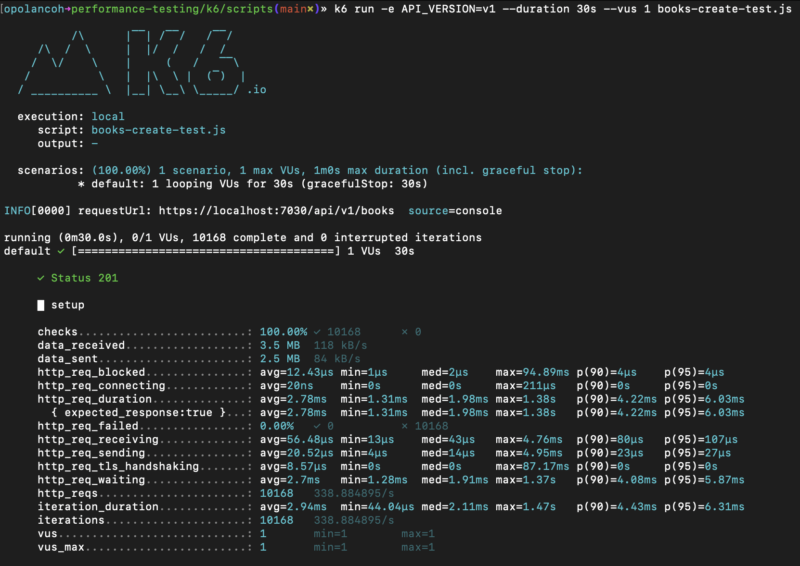
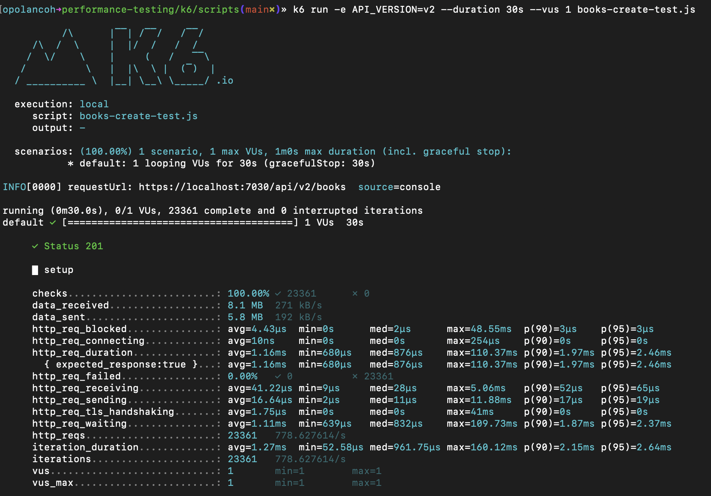
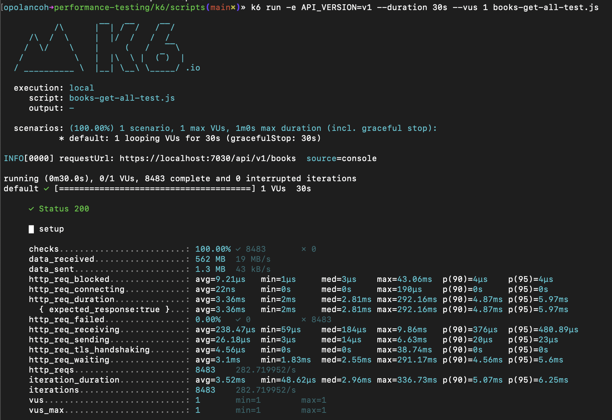
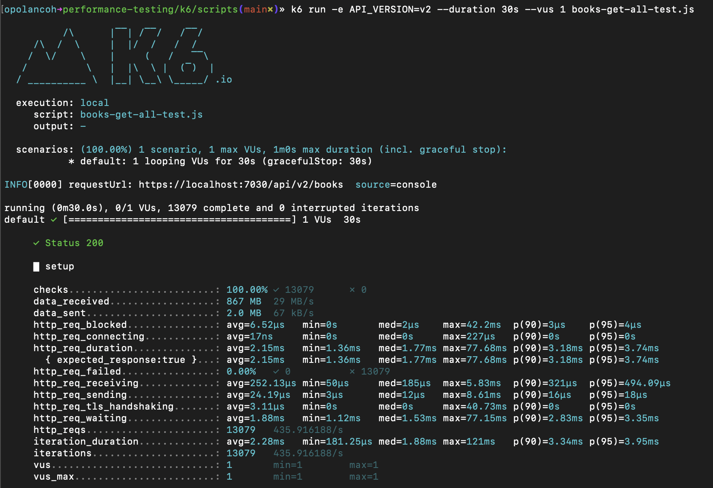
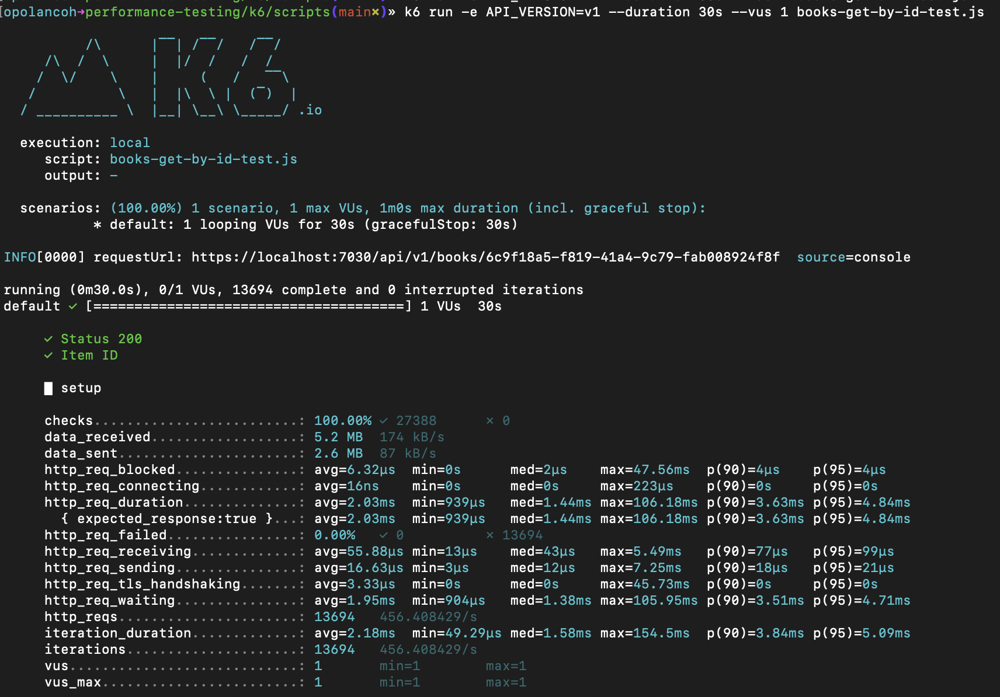
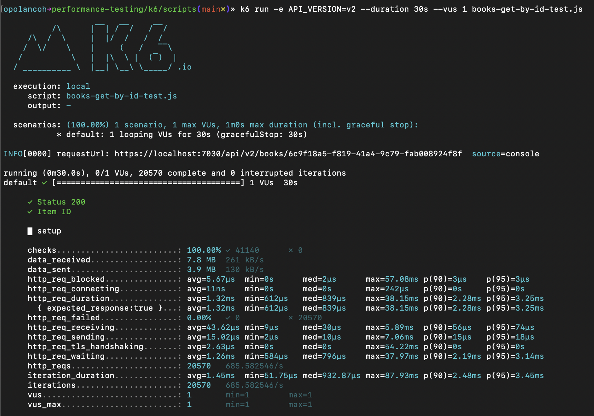
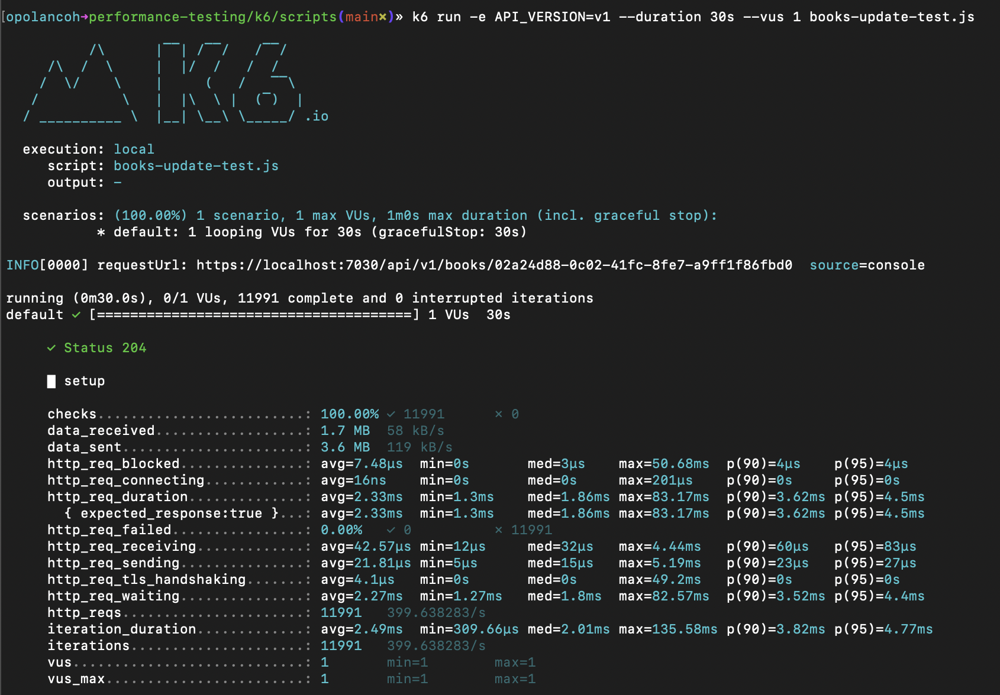
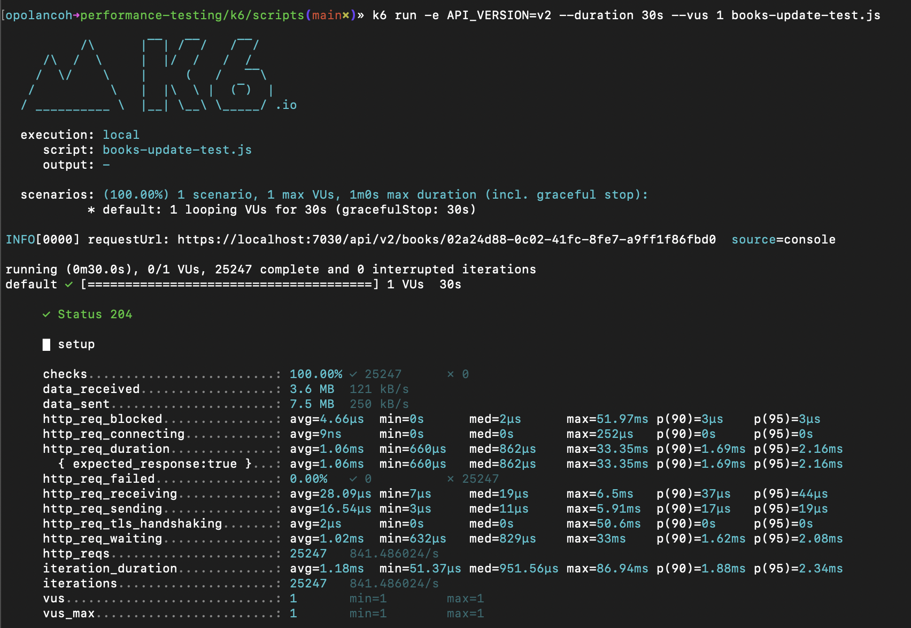
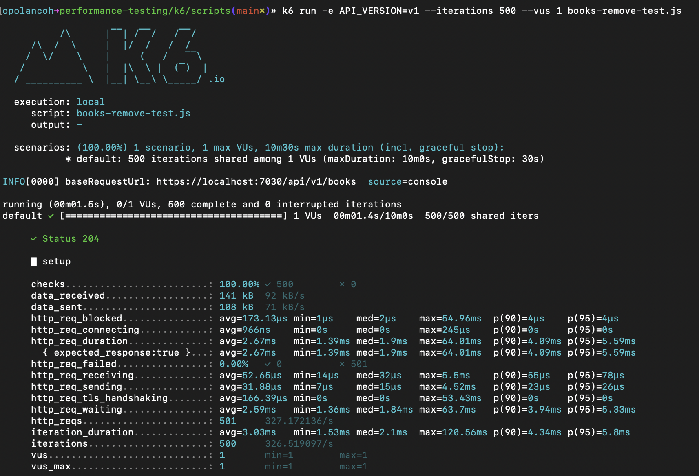
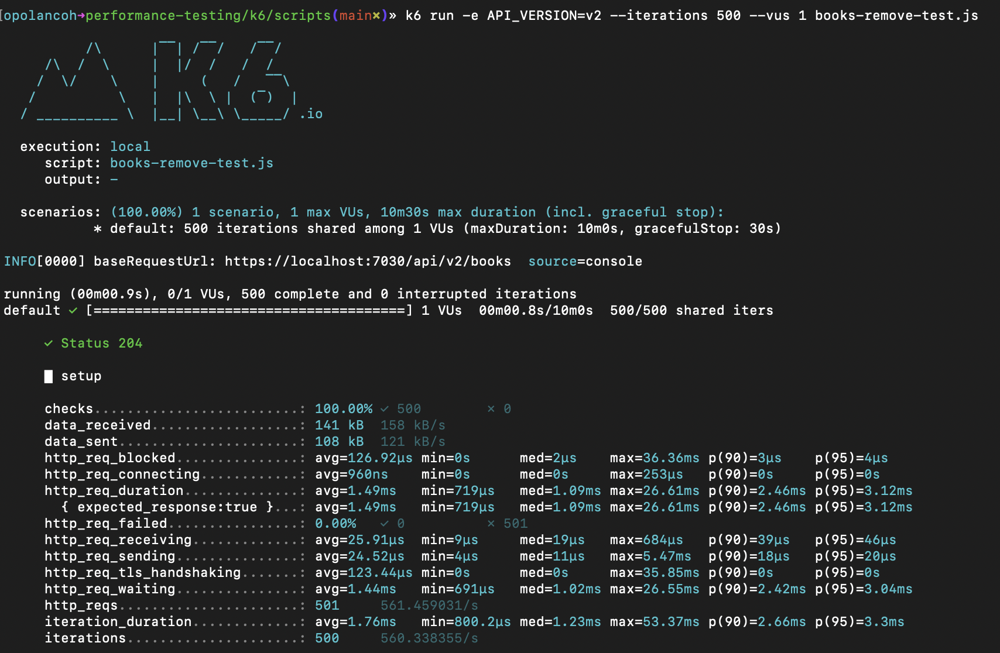

# EF Core vs Dapper Query Performance Testing
A sample .NET Core web api to compare EF Core and Dapper query performance from a Postgres database.

**In general, the results show that Dapper offers much faster performance compared to EF Core. All the test analysis validate that, but with Dapper you have to write more code and worry about the database, table and column creation.**

[Entity Framework (EF) Core](https://learn.microsoft.com/en-us/ef/core) is a lightweight, extensible, open source and cross-platform version of the popular Entity Framework data access technology.

[Dapper](https://www.learndapper.com) is a simple object mapper for the Microsoft .NET platform. It is a framework for mapping an object-oriented domain model to a traditional relational database.

The data model is represented in the next image:
<p align="center">
  
</p>

#### Technologies in this repo:
* DotNet Core 6
* Entity Framework 6
* Dapper 2
* k6 (performance testing)
* Postgres (Docker Container)
* xUnit (Integration Tests)

#### Setup Database
Create the database container (you need to have Docker installed on your system):

```sh
docker run -d --name my-postgres -p 5432:5432 -e POSTGRES_PASSWORD=My@Passw0rd postgres
```

Stop and remove the container when needed:

```sh
docker stop my-postgres && docker rm my-postgres
```

#### Create Database

```sh
dotnet ef database update --project EntityFrameworkDapperApp.Repository.EntityFramework --startup-project EntityFrameworkDapperApp.Web
```

## Performance Testing Analysis
The idea is to create one analysis for every CRUD item. The duration of every performance test is 30 seconds, except for the DELETE request, where we will create 500 iterations.

In general, we want to see how many requests we can do in those 30 seconds and analyze all the benchmarking results.

### **CREATE (http post)**

* 30 seconds
* 1 user

**Entity Framework**
```sh
k6 run -e API_VERSION=v1 --duration 30s --vus 1 books-create-test.js
```
<p align="center">
  
</p>

**Dapper**
```sh
k6 run -e API_VERSION=v2 --duration 30s --vus 1 books-create-test.js
```
<p align="center">
  
</p>

**Results**:

| http_req_duration       | avg | min | med | max | p(90) | p(95) | iterations |
|-----------| --- | --- | --- | --- | --- | --- |------------|
| `EF Core` | 2.78ms | 1.31ms | 1.98ms | 1.38s | 4.22ms | 6.03ms | 10.168     |
| `Dapper`  | 1.16ms | 680µs | 876µs | 110.37ms | 1.97ms | 2.46ms | 23.361     |

In 30 seconds:
* Iterations: Dapper inserted 13.193 more rows than EF Core
* Average: Dapper is 2.4x faster than EF Core


### **GET ALL (http get)**

* 30 seconds
* 1 user

**Entity Framework**
```sh
k6 run -e API_VERSION=v1 --duration 30s --vus 1 books-get-all-test.js
```
<p align="center">
  
</p>

**Dapper**
```sh
k6 run -e API_VERSION=v2 --duration 30s --vus 1 books-get-all-test.js
```
<p align="center">
  
</p>

**Results**:

| http_req_duration       | avg | min | med | max | p(90) | p(95) | iterations |
|-----------| --- | --- | --- | --- | --- | --- |------------|
| `EF Core` | 3.36ms | 2ms | 2.81ms | 292.16ms | 4.87ms | 5.97ms | 8.483      |
| `Dapper`  | 2.15ms | 1.36ms | 1.77ms | 77.68ms | 3.18ms | 3.74ms | 13.079     |

In 30 seconds:
* Iterations: Dapper fetched 4.596 more rows than EF Core
* Average: Dapper is 1.6x faster than EF Core


### **GET BY ID (http get)**

* 30 seconds
* 1 user

**Entity Framework**
```sh
k6 run -e API_VERSION=v1 --duration 30s --vus 1 books-get-by-id-test.js
```
<p align="center">
  
</p>

**Dapper**
```sh
k6 run -e API_VERSION=v2 --duration 30s --vus 1 books-get-by-id-test.js
```
<p align="center">
  
</p>

**Results**:

| http_req_duration       | avg | min | med | max | p(90) | p(95) | iterations |
|-----------| --- | --- | --- | --- | --- | --- |------------|
| `EF Core` | 2.03ms | 939µs | 1.44ms | 106.18ms | 3.63ms | 4.84ms | 13.964     |
| `Dapper`  | 1.32ms | 612µs | 839µs | 38.15ms | 2.28ms | 3.25ms | 20.570     |

In 30 seconds:
* Iterations: Dapper fetched 6.606 more rows than EF Core
* Average: Dapper is 1.5x faster than EF Core


### **UPDATE (http put)**

* 30 seconds
* 1 user

**Entity Framework**
```sh
k6 run -e API_VERSION=v1 --duration 30s --vus 1 books-update-test.js
```
<p align="center">
  
</p>

**Dapper**
```sh
k6 run -e API_VERSION=v2 --duration 30s --vus 1 books-update-test.js
```
<p align="center">
  
</p>

**Results**:

| http_req_duration       | avg | min | med | max | p(90) | p(95) | iterations |
|-----------| --- | --- | --- | --- | --- | --- |------------|
| `EF Core` | 2.33ms | 1.3ms | 1.86ms | 83.17ms | 3.62ms | 4.5ms | 11.991     |
| `Dapper`  | 1.06ms | 660µs | 862µs | 33.35ms | 1.69ms | 2.16ms | 25.247     |

In 30 seconds:
* Iterations: Dapper updated 13.256 more rows than EF Core
* Average: Dapper is 2.2x faster than EF Core


### **REMOVE (http delete)**

* 500 iterations
* 1 user

**Entity Framework**
```sh
k6 run -e API_VERSION=v1 --iterations 500 --vus 1 books-remove-test.js
```
<p align="center">
  
</p>

**Dapper**
```sh
k6 run -e API_VERSION=v2 --iterations 500 --vus 1 books-remove-test.js
```
<p align="center">
  
</p>

**Results**:

| http_req_duration       | avg | min | med | max | p(90) | p(95) | iterations |
|-----------| --- | --- | --- | --- | --- | --- |------------|
| `EF Core` | 2.67ms | 1.39ms | 1.9ms | 64.01ms | 4.09ms | 5.59ms | 500        |
| `Dapper`  | 1.49ms | 719µs | 1.09ms | 26.61ms | 2.46ms | 3.12ms | 500        |

In 500 iterations:
* Iterations: N/A
* Average: Dapper is 1.8x faster than EF Core
